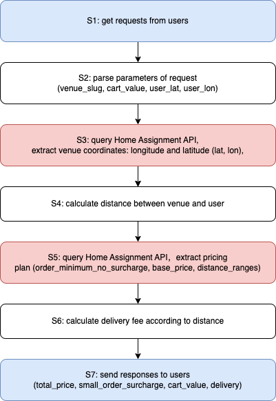
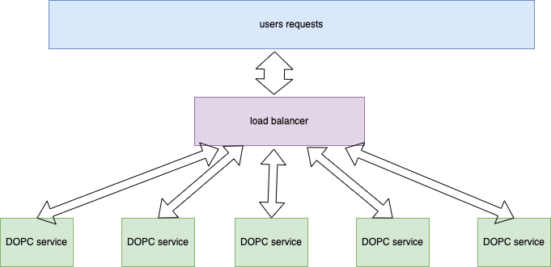
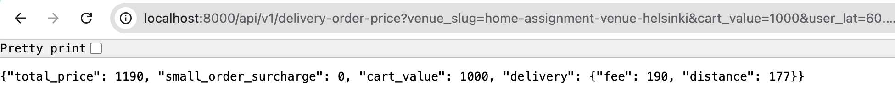

# Design Document of DOPC service

The task of the project is to develop a DOPC (Delivery Order Price Calculator) service for Wolt. It is an imaginary backend service which calculates the total price and price breakdown of a delivery order for a user.

DOPC interacts with the Home Assignment API to fetch venue related data required to calculate the prices. The term venue refers to any kind of restaurant / shop / store. It first requests for the venue's location, then calculates the price based on its distance to the user and the price rules. 

The DOPC service provides a single endpoint: `GET /api/v1/delivery-order-price`, which takes the following as query parameters:

- venue_slug (string): The unique identifier (slug) for the venue from which the delivery order will be placed
- cart_value (integer): The total value of the items in the shopping cart
- user_lat (number with decimal point): The latitude of the user's location
- user_lon (number with decimal point): The longitude of the user's location

The endpoint should return a JSON response in the following format:

```JSON
{
  "total_price": 1190,
  "small_order_surcharge": 0,
  "cart_value": 1000,
  "delivery": {
    "fee": 190,
    "distance": 177
  }
}
```
where

- total_price (integer): The calculated total price
- small\_order\_surcharge (integer): The calculated small order surcharge
- cart_value (integer): The cart value. This is the same as what was got as query parameter.
- delivery (object): An object containing
    * fee (integer): The calculated delivery fee
    * distance (integer): The calculated delivery distance in meters

Home Assignment API is a backend service from which DOPC requests for data. It provides two JSON endpoints:

- Static information about a venue: 
 `https://consumer-api.development.dev.woltapi.com/home-assignment-api/v1/venues/home-assignment-venue-helsinki/static`
- Dynamic information about a venue
`https://consumer-api.development.dev.woltapi.com/home-assignment-api/v1/venues/home-assignment-venue-helsinki/dynamic`

DOPC requests for the location of the venue `[longitude, latitude]` from the static endpoint. It requests for `order_minimum_no_surcharge`, `base_price`, and `distance_ranges` from the dynamic endpoint.

More details about the task can be found [here](https://github.com/woltapp/backend-internship-2025).

## 1 General Work Flow

Without considering potential errors, the entire workflow for processing a user's request can be divided into 7 states：

- S1: get requests from users
- S2: parse parameters of request (venue\_slug, cart\_value, user\_lat, user\_lon)
- S3: query Home Assignment API (static), extract venue coordinates: longitude and latitude (lat, lon)
- S4: calculate distance between the venue and the user
- S5: query Home Assignment API (dynamic)，extract pricing plan (order\_minimum\_no\_surcharge, base\_price, distance\_ranges) 
- S6: calculate delivery fee according to the distance and pricing plan
- S7: send responses back to users (total\_price, small\_order\_surcharge, cart\_value, delivery)



The workflow can be divided into three types of states:

- User interaction states (S1 and S7, shown in blue in the flowchart): Where DOPC communicates directly with users
- API interaction states (S3 and S5, shown in pink): Where DOPC makes requests to the Home Assignment API
- Local processing states (S2, S4, and S6, shown in white): Where DOPC performs calculations and validations internally


## 2 Full Work Flow with Error Handling

Since some states involve logic that are out of our control, the complete workflow incorporates error handling in four critical states:

- State 2 (Parameter Validation): Verifies user input parameters like venue_slug, cart_value, and coordinates. Invalid inputs result in Validation Errors.
- State 6 (Business Logic): Validates calculated results against business rules, such as minimum order amounts and delivery fee limits. Violations trigger Business Logic Errors.
- States 3 and 5 (API Communication): Handle potential Network Errors when interacting with the Home Assignment API, including timeouts, connection failures, and invalid responses.

When a user request fails to be processed, DOPC will return the processing status and corresponding error message to the user without terminating the entire process.


## 3 Implementation

### 3.1 Tech Selection

DOPC is implemented using Python and the aiohttp web framework for several key reasons:

- Python was chosen as the programming language due to its extensive ecosystem and my familiarity with it
- aiohttp provides excellent support for asynchronous I/O and high concurrency, which is critical for handling multiple simultaneous requests efficiently
- The framework is lightweight yet powerful, making it ideal for a focused microservice like DOPC
- aiohttp's dual functionality as both HTTP client and server simplifies the architecture, as DOPC needs to both serve user requests and communicate with the Home Assignment API
- Built-in support for RESTful routing and middleware makes it easy to implement the required API endpoints
- Integration with validation libraries like pydantic enables robust request/response handling and error management
- The async/await syntax results in clean, maintainable code that clearly expresses the asynchronous flow
- The framework's modular design allows for easy scaling through multiple service instances managed by a load balancer

### 3.2 Major challenges

In the implementation, I have identified the following challenges:

- Error handling (see next section for details)
- Distance calculation in S4: we need to calculate the distance between two GPS locations on the earth surface (sphere surface), for which I use the solution provided by chatGPT. 
- TCP connections reuse: For each user request, DOPC needs to query Home Assignment API twice. If we establish seperate TCP connections with the Home Assignment API for each user request, then the overhead will be high. It will be better if we could establish a stable TCP connection pool with the Home Assignment API and reuse them for each user request. 
- Scalability: if we consider there are large amounts of incoming user requests, a single DOPC service may not be able to provide timely responses. Due to the nature of coroutine, a single DOPC service is a single process that can maximumly use one CPU core. My solution is to create a load balancer and allocate the requests to different DOPC servers.


### 3.3 Overall Implementation Details

I have completed a scalable DOPC service, which mainly consists of the following parts：

- `README.md`
- `DOPC_design_document.md`:       Design document of DOPC service
- `config.toml`:                   Configuration file
- `server.py`:                     DOPC server (call either `dopc_service.py` or `load_balancer.py`, set by `use_balancer_flag` in `config.toml`)
- `dopc_service.py`:               A DOPC service, can run independently
- `load_balancer.py`:              Load balancer
- `mock_user_requests.py`:         User request simulator for integrate test
- `mock_home_assignment_api.py`:   Home Assignment API simulator for integrate test
- `test_rate_limits.py`:           Test rate limits of Home Assignment API
- `images/`                        Image files directory

### 3.4 Shared TCP connections in `dopc_service.py` 

In `dopc_service.py`, we use a shared session pool to improve the efficiency when interacting with Home Assignment API. Session pool allows connection reuse and reduces the overhead of creating and closing sessions for each request.

```python
class APIConnectionPool:
    def __init__(self, pool_size: int = 5, health_check_interval: int = 30):
        .
        .
        # Use lists for session pools
        self.static_sessions = []
        self.dynamic_sessions = []
```

There is an internal pointer (rotational increase) to select the corresponding sessions for each user request. Another key feature is that we check the health of the sessions by sending a request to Home Assignment API every 30 seconds, and replace it when necessary.

### 3.5 Load Balancer (`load_balancer.py`) for large amounts of user requests 

`load_balancer.py` is a shechuler which starts multiple DOPC services as separate processes and forwards user requests to these DOPC services. Like `APIConnectionPool`, there are stable connections between the load_balancer and the DOPC services, as well as health check of the connections. 



The following snippet shows how the load balancer start DOPC services.

```python
    async def start(self):
        """Initialize services and establish connections"""
        print(f"Starting {self.num_services} DOPC services...")
        for i in range(self.num_services):
            port = self.base_port + i
            # Start service process
            process = subprocess.Popen(
                ["python", "dopc_service.py", str(port)],
                stdout=subprocess.PIPE,
                stderr=subprocess.PIPE,
                text=True  # Get text output
            )
            self.services[port] = process
```

### 3.6 Semaphore for DOPC

To manage computational resources effectively, each DOPC service implements a Semaphore with a limit of 5000 concurrent requests. This ensures controlled resource utilization while maintaining service stability and responsiveness, as demonstrated in the following code snippet.

```python
# Create a global semaphore to limit concurrent requests
request_semaphore = asyncio.Semaphore(N_MAX_REQUEST)  # Max concurrent requests

# Define handlers
async def calculate_delivery_price(request):
    try:
        # Try to acquire semaphore
        async with request_semaphore:
            # Log incoming request
            current_time = time.strftime("%H:%M:%S")
            print(f"[{current_time}] Received request")
```

However, I think this might not be necessary since aiohttp web server (web.Application) has its own internal request handling mechanism to prevent overwhelming. But I just keep semaphore for DOPC in case of unexpected circumstances. 


### 3.7 Configuration file `config.toml`

In `config.toml`, we can configure different options

```toml
[general]
host="localhost"
use_balancer_flag=false   # if start load_balancer.py or dopc_service.py
dopc_end_point='/api/v1/delivery-order-price'
dopc_port = 8000

[dopc_service]
mock_home_assignment_flag = false # if use mock_home_assignment_api.py
n_max_request=5000  # maximum number of user requests that can be handled per dopc service process
base_api_url = "https://consumer-api.development.dev.woltapi.com/home-assignment-api/v1"
mock_base_api_url = "http://localhost:10000/home-assignment-api/v1"

[dopc_balancer]
service_port_start = 49152  # Using dynamic port range, port for dopc services
num_services = 5 # number of dopc services
```

## 4 Error Handling Methods

DOPC implements a multi-layer error handling strategy to handle Validation Errors, Network Errors and Business Logic Errors.

### 4.1 Validation Errors Handling (Pydantic)

It is uncertain whether there are Validation Errors when user send their requests. DOPC uses BaseModel for validation and type checking. When Errors happen, DOPC returns users a consistent error format:

- Success indicator (boolean)
- Error description (string)


```python
class DeliveryDetails(BaseModel):
    fee: int = Field(..., gt=0, description="Delivery fee in cents")
    distance: int = Field(..., gt=0, description="Distance in meters")

    @field_validator('fee')
    @classmethod
    def validate_fee(cls, v):
        if v < 0:
            raise ValueError('Delivery fee cannot be negative')
        if v > 1500000:  # 15000 EUR
            raise ValueError('Delivery fee exceeds maximum allowed value')
        return v
```

Key Models:

- `DeliveryOrderRequest`: Validates incoming request parameters
- `DeliveryPriceResponse`: Ensures response format consistency
- `DeliveryDetails`: Validates delivery-specific data


### 4.2 Network Errors Handling

It is uncertain whether there are Network Errors such as Timeouts, Connection failures, and API unavailable When DOPC makes requests to Home Assignment API or scheduler makes requests to multiple DOPC services, so some verification is also required. When Network Errors happen, DOPC returns users a consistent error format:

- Success indicator (boolean)
- Error description (string)


```python

async def make_request(self, session: ClientSession, url: str) -> Tuple[bool, Dict[str, Any] | str]:
    """Make request with timeout handling"""
    try:
        async with session.get(url) as response:
            if response.status == 200:
                return True, await response.json()
            else:
                return False, f"Request failed with status: {response.status}"
    except asyncio.TimeoutError:
        return False, "Request timed out"
    except Exception as e:
        return False, f"Request error: {str(e)}"
```

### 4.3 Business Logic Errors Handling

It is uncertain whether there are Business Logic Errors such as Distance exceeded, Invalid coordinates and Price calculation in the data extracted from Home Assignment API, so some verification is also required. When Errors happen, DOPC returns users a consistent error format:

- Success indicator (boolean)
- Error description (string)

Custom validation for coordinate data:

```python
def validate_coordinates(self, lat: float, lon: float) -> Tuple[bool, str]:
    """Validate latitude and longitude values"""
    try:
        if not isinstance(lat, (int, float)) or not isinstance(lon, (int, float)):
            return False, "Coordinates must be numeric"
        if not -90 <= lat <= 90:
            return False, f"Invalid latitude: {lat}. Must be between -90 and 90"
        if not -180 <= lon <= 180:
            return False, f"Invalid longitude: {lon}. Must be between -180 and 180"
        return True, ""
    except Exception as e:
        return False, f"Coordinate validation error: {str(e)}"
```


## 5 Test

### 5.1 Unit Test

I did not perform unit test since the implementations only involve simple calculations and there are enough error handling to capture the errors.

### 5.2 Integrate Test

#### 5.2.1 Single user request test using curl

```bash
curl "http://localhost:8000/api/v1/delivery-order-price?venue_slug=home-assignment-venue-helsinki&cart_value=2000&user_lat=60.17094&user_lon=24.93087"
```

Reponse is as expected. DOPC returned a Json response:

```json
{
       "total_price": 2190,
       "small_order_surcharge": 0,
       "cart_value": 2000,
       "delivery": {
           "fee": 190,
           "distance": 177
       }
   }
```

```bash
curl "http://localhost:8000/api/v1/delivery-order-price?venue_slug=home-assignment-venue-helsinki&cart_value=2000&user_lat=200.17094&user_lon=24.93087"
```

Reponse is as expected. DOPC returned error information.

```bash
{"success": false, "error": "Validation error: 1 validation error for DeliveryOrderRequest\nuser_lat\n  Value error, Latitude must be between -90 and 90 degrees [type=value_error, input_value=200.17094, input_type=float]\n    For further information visit https://errors.pydantic.dev/2.10/v/value_error"}
```

#### 5.2.2 Single user request test using Chrome
    
Test URL: <http://localhost:8000/api/v1/delivery-order-price?venue_slug=home-assignment-venue-helsinki&cart_value=1700&user_lat=60.17094&user_lon=24.93087>
   
Or click [here](http://localhost:8000/api/v1/delivery-order-price?venue_slug=home-assignment-venue-helsinki&cart_value=1700&user_lat=60.17094&user_lon=24.93087) to test the service.

Response is as expected:



#### 5.2.3 Batch user request test

While single user request testing confirms basic functionality of the DOPC service, it does not validate the service's ability to handle concurrent requests at scale - a critical requirement for production environments. To address this limitation, we developed `mock_user_requests.py`, a simulator tool that generates and sends multiple simultaneous requests to stress test the service under load.

Start the simulator：

```bash
   # Default: 50 users, 0.5s delay between requests, 2 requests per user
   python mock_user_requests.py

   # Or, custom configuration
   python mock_user_requests.py --users 50 --delay 0.5 --requests 2
```
Test results for simulating 50 users, 0.5s delay between requests, 2 requests per user:

```bash
    Starting simulation with 50 users...
    User  13 | Rate Limited | Time: 0.459s
    User  25 | Rate Limited | Time: 0.459s
    ......
    User  12 | Status: 200 | Time: 2.269s | Price: 1690 cents
    User  18 | Status: 200 | Time: 2.269s | Price: 2082 cents
    User  23 | Distance Exceeded | Time: 2.269s
    ^C
    Simulation completed in 2.56 seconds

    === Test Summary ===
    Total Users: 50
    Requests per User: 2
    Total Requests: 50

    Response Breakdown:
    ✅ Successful: 24 (48.0%)
    📍 Distance Exceeded: 16 (32.0%)
    ⏳ Rate Limited: 10 (20.0%)
    ❌ Other Errors: 0 (0.0%)
    🔌 Connection Errors: 0 (0.0%)

    Timing Statistics:
    Average Response Time: 1.315s
    Min Response Time: 0.459s
    Max Response Time: 2.269s

    Simulation stopped by user
```

The test results demonstrate that DOPC successfully processed requests and handled errors as designed. However, a notable observation is that 20% of requests failed due to rate limiting. Further testing with the simulator consistently showed rate-limited failures around 30% of total requests. This concerning pattern warrants deeper investigation, which will be explored in the following section.

## 6 Problems In Practice

Several issues were encountered during implementation and testing that require further investigation to determine whether they originate from DOPC or external factors.

### 6.1 Request Failures Due to Rate Limiting

During testing with the user simulator, we observed a consistently high percentage of request failures due to rate limiting. We hypothesized that these failures stemmed from access restrictions imposed by the Home Assignment API rather than issues within DOPC itself. To verify this hypothesis, we conducted targeted testing of the Home Assignment API's rate limiting behavior using `test_rate_limits.py`, which sends 100 requests with a 0.1-second delay between each request. The test results, shown below, revealed that approximately 20% of direct requests to the Home Assignment API failed due to rate limiting, confirming that the API's built-in rate limiting mechanism is indeed the source of these failures.

```bash
python test_rate_limits.py

Starting rate limit test at 2025-01-23 17:43:28.798051
Making 100 requests with 0.1s delay between requests
...
=== Test Summary ===
Duration: 12.34 seconds
Total Requests: 100

Response Breakdown:
✅ Successful: 80 (80.0%)
⏳ Rate Limited: 20 (20.0%)
📍 Distance Exceeded: 0 (0.0%)
❌ Other Errors: 0 (0.0%)
🔌 Connection Errors: 0 (0.0%)

Timing Statistics:
Average Response Time: 1.504s
Min Response Time: 0.583s
Max Response Time: 2.208s
Requests/Second: 8.1

```

### 6.2 Testing based on Mock Home Assignment API

To properly test the DOPC code in isolation, we created a simulator for the Home Assignment API called `mock_home_assignment_api.py` that removes the rate limiting constraints. Using this simulator in place of the actual Home Assignment API, we ran the user simulator tests again with the following results:

```bash
python mock_user_requests.py --users 50 --delay 0.5 --requests 2
```

```bash
Starting simulation with 50 users...
User   3 | Status: 200 | Time: 0.048s | Price: 3390 cents
User   6 | Status: 200 | Time: 0.048s | Price: 2390 cents
......
User  15 | Status: 200 | Time: 0.004s | Price: 1390 cents
User  34 | Distance Exceeded | Time: 0.002s
User  38 | Status: 200 | Time: 0.002s | Price: 2390 cents

User  33 | Distance Exceeded | Time: 0.187s
^C
Simulation completed in 5.50 seconds

=== Test Summary ===
Total Users: 50
Requests per User: 2
Total Requests: 100

Response Breakdown:
✅ Successful: 85 (85.0%)
📍 Distance Exceeded: 15 (15.0%)
⏳ Rate Limited: 0 (0.0%)
❌ Other Errors: 0 (0.0%)
🔌 Connection Errors: 0 (0.0%)

Timing Statistics:
Average Response Time: 0.121s
Min Response Time: 0.002s
Max Response Time: 0.212s

Simulation stopped by user
```
The test results confirm that our implementation is working as intended. With the mock API that removes rate limiting, no requests failed due to rate limits, validating that our code itself is not the source of any rate limiting issues. This provides confidence in the robustness of our implementation.


## 7 Feature Highlights

I would like to highlight some features in the DOPC implementation:

- load balancer
- Shared TCP connections (connections monitor and recover)
- mock user requests
- mock Home Assignment API
- parameter configuration in one place: `config.toml` 

These features may be useful in the actual production.