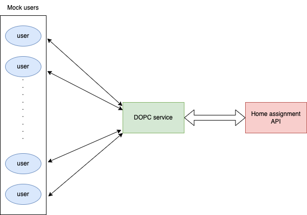
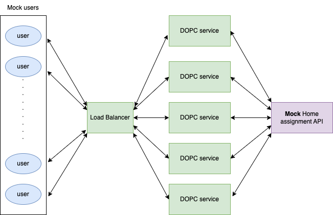

# Delivery Order Price Calculator (DOPC) Service

A scalable service that calculates delivery prices based on distance and cart value. The service includes a load balancer to distribute requests across multiple instances.

This document only explains how to run the service. The design document of this project is given in the [`DOPC_design_document.md`](./DOPC_design_document.md) file. 

## Requirements

Python 3.10+

Required packages:

```bash
pip install aiohttp pydantic tomli
```

## Project Structure

```
.
├── README.md
├── config.toml                  # Configuration file
├── server.py                    # DOPC server (call either dopc_service.py or load_balancer.py, set by `use_balancer_flag` in `config.toml`)
├── dopc_service.py              # A DOPC service, can run independently
├── load_balancer.py             # Load balancer
├── mock_user_requests.py        # User request simulator for integrate test
├── mock_home_assignment_api.py  # Home Assignment API simulator for integrate test
├── test_rate_limits.py          # Test rate limits of Home Assignment API
├── DOPC_design_document.md      # Design document of DOPC service
├── images/                      # Image files directory
└── logs/                        # Service logs directory
```

## Configuration

Edit `config.toml` to customize settings:

```toml
[general]
host="localhost"
use_balancer_flag= false   # if start load_balancer.py or dopc_service.py
dopc_end_point='/api/v1/delivery-order-price'
dopc_port = 8000

[dopc_service]
mock_home_assignment_flag = false # if use mock_home_assignment_api.py
n_max_request=5000  # maximum number of user requests that can be handled per dopc service process
base_api_url = "https://consumer-api.development.dev.woltapi.com/home-assignment-api/v1"
mock_base_api_url = "http://localhost:10000/home-assignment-api/v1"

[dopc_balancer]
service_port_start = 49152  # Using dynamic port range, port for dopc services
num_services = 5 # number of dopc services

```

## Running the Service (Simple case)

In the simple case, we use the wolt home assignment API.

1. **Start a single DOPC service**

  ```bash
  python dopc_service.py
  ```

  Or run `server.py` (call either `dopc_service.py` or `load_balancer.py`, set by `use_balancer_flag` in `config.toml`)

2. **Testing the Service**

  2.1 Single user request test using curl:

    ```bash
    curl "http://localhost:8000/api/v1/delivery-order-price?venue_slug=home-assignment-venue-helsinki&cart_value=2000&user_lat=60.17094&user_lon=24.93087"
    ```
    Or paste the link to a web browser.

    We expect to see the json response given by the DOPC service.

  2.2 Batch user request test:

    In a new terminal, type the following command to simulate 50 users each sending 2 requests, 0.5s delay between requests.

    ```bash
    python mock_user_requests.py
    ```

    We expect to see the following output:

    ```bash
    Starting simulation with 50 users...
    User   2 | Rate Limited | Time: 0.304s
    User  22 | Rate Limited | Time: 0.350s
    ....
    User  14 | Distance Exceeded | Time: 1.114s
    User  15 | Status: 200 | Time: 1.122s | Price: 3065 cents

    Simulation completed in 2.87 seconds

    === Test Summary ===
    Total Users: 50
    Requests per User: 2
    Total Requests: 50

    Response Breakdown:
    ✅ Successful: 13 (26.0%)
    📍 Distance Exceeded: 9 (18.0%)
    ⏳ Rate Limited: 28 (56.0%)
    ❌ Other Errors: 0 (0.0%)
    🔌 Connection Errors: 0 (0.0%)

    Timing Statistics:
    Average Response Time: 0.619s
    Min Response Time: 0.304s
    Max Response Time: 1.122s
    ```

    Use `CTRL-C` to stop the request.

    The whole process is shown in the figure below:

    

## Running the Service (Production case)

In the production case, we will start a load balancer, which starts 5 DOPC services. We also use mock home assignment API to avoid rate limiting by the actual home assignment API.

1. **Modify the `config.toml` file**

  Set `use_balancer_flag` and `mock_home_assignment_flag` to true in the `config.toml` file.

2. **Start Mock Home Assignment API**

  In a terminal, type the following command:

  ```bash
  python mock_home_assignment_api.py
  ```

3. **Start Load Balancer** 

  In a new terminal, type the following command:

  ```bash
  python load_balancer.py
  ```
  This will automatically start 5 DOPC services.

  Or run `server.py` (call either `dopc_service.py` or `load_balancer.py`, set by `use_balancer_flag` in `config.toml`)

4. **Testing the Service**

  4.1 Single user request test using curl:

    ```bash
    curl "http://localhost:8000/api/v1/delivery-order-price?venue_slug=home-assignment-venue-helsinki&cart_value=2000&user_lat=60.17194&user_lon=24.93087"
    ```
    Or paste the link to a web browser.

    We expect to see the json response given by the DOPC service.

  4.2 Batch user request test:

    In a new terminal, type the following command to simulate 50 users each sending 2 requests, 0.5s delay between requests.

    ```bash
    python mock_user_requests.py
    ```
    We expect to see the following output:

    ```bash
    Starting simulation with 50 users...
    User   0 | Status: 200 | Time: 0.058s | Price: 3490 cents
    User   1 | Status: 200 | Time: 0.075s | Price: 2890 cents
    User   3 | Status: 200 | Time: 0.079s | Price: 1890 cents
    User   6 | Distance Exceeded | Time: 0.082s
    User   4 | Status: 200 | Time: 0.117s | Price: 2590 cents
    User   5 | Status: 200 | Time: 0.117s | Price: 1490 cents
    User  19 | Status: 200 | Time: 0.115s | Price: 2890 cents
    ....
    User  47 | Status: 200 | Time: 0.029s | Price: 2990 cents
    User  37 | Status: 200 | Time: 0.028s | Price: 2490 cents
    User  48 | Status: 200 | Time: 0.030s | Price: 2390 cents
    User  33 | Status: 200 | Time: 0.030s | Price: 1390 cents
    User  49 | Status: 200 | Time: 0.030s | Price: 2890 cents
    User  13 | Status: 200 | Time: 0.028s | Price: 3490 cents
    ^C
    Simulation completed in 4.86 seconds

    === Test Summary ===
    Total Users: 50
    Requests per User: 2
    Total Requests: 100

    Response Breakdown:
    ✅ Successful: 70 (70.0%)
    📍 Distance Exceeded: 30 (30.0%)
    ⏳ Rate Limited: 0 (0.0%)
    ❌ Other Errors: 0 (0.0%)
    🔌 Connection Errors: 0 (0.0%)

    Timing Statistics:
    Average Response Time: 0.094s
    Min Response Time: 0.005s
    Max Response Time: 0.223s
    ```
    Use `CTRL-C` to stop the request.

    The whole process is shown in the figure below:

    


